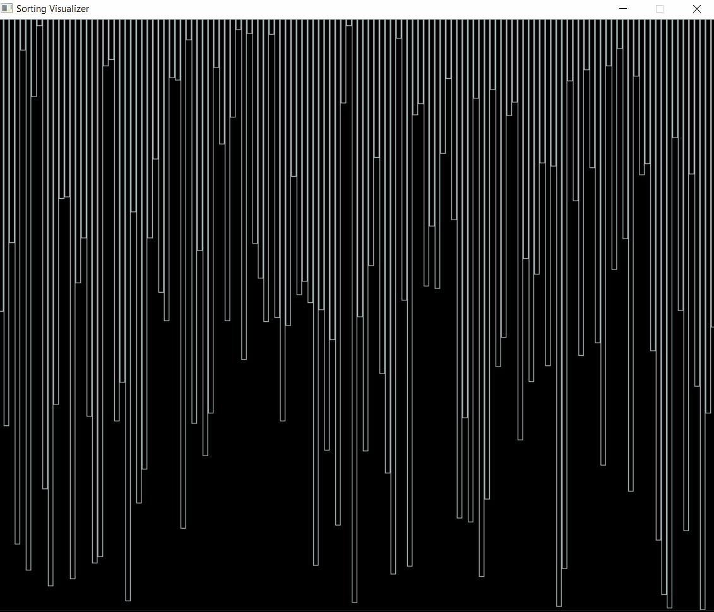
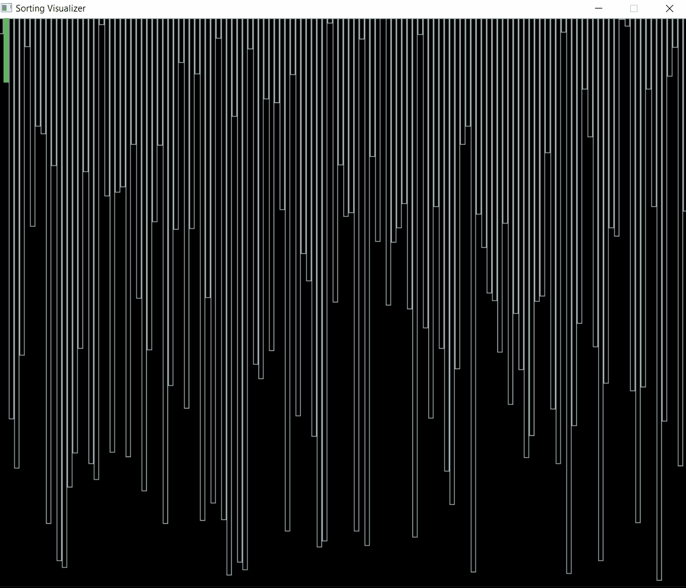

# Controls:-

WARNING: Giving repetitive commands may cause latency and the visualizer may behave unexpectedly. Please give a new command only after the current command's execution is done.

Available Controls inside Sorting Visualizer:-
- Use 0 to Generate a different randomized list.
- Use 1 to start Selection Sort Algorithm.
- Use 2 to start Insertion Sort Algorithm.
- Use 3 to start Bubble Sort Algorithm.
- Use 4 to start Merge Sort Algorithm.
- Use 5 to start Quick Sort Algorithm.
- Use 6 to start Heap Sort Algorithm.
- Use q to exit out of Sorting Visualizer

# Samples

- Sample 1 (Insertion Sort)

- Sample 2 (Merge Sort)

